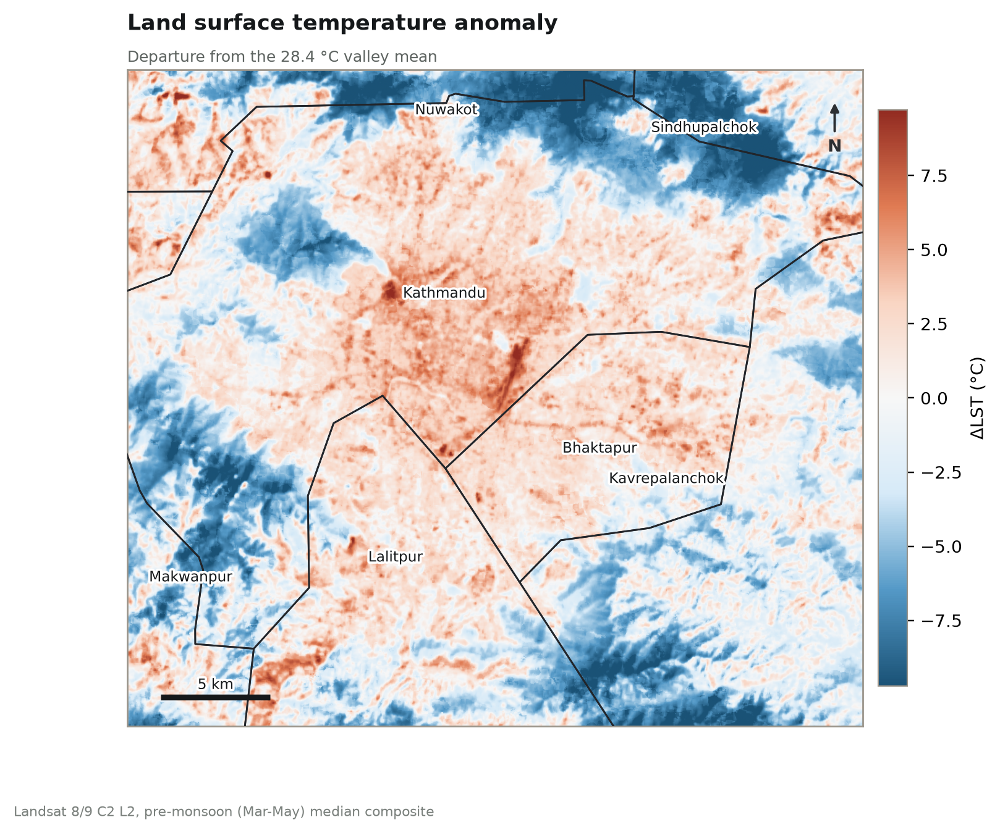

# Urban Heat and Green-Space Assessment — Kathmandu Valley, Nepal

Google Earth Engine · Python (rasterio, matplotlib, pandas) · Excel

Pre-monsoon land surface temperature, vegetation condition and green-space cover across
Kathmandu Valley, summarised by district, with a reproducible pipeline from satellite
imagery to a finished technical brief.



---

## Findings

Land surface temperature was derived from a March–May median composite of Landsat 8/9
Collection 2 Level 2 (23 scenes), and summarised over the eight districts intersecting the
valley extent.

| District | LST °C | ΔLST °C | Green cover | Built-up |
| --- | ---: | ---: | ---: | ---: |
| Bhaktapur | 30.0 | **+1.62** | 82.4% | 17.1% |
| Kathmandu | 29.1 | **+0.69** | 75.5% | 23.7% |
| Lalitpur | 28.8 | **+0.41** | 79.4% | 19.4% |
| Dhading | 28.5 | +0.10 | 98.4% | 1.4% |
| Sindhupalchok | 27.6 | −0.77 | 98.6% | 0.8% |
| Kavrepalanchok | 27.3 | −1.04 | 96.6% | 3.2% |
| Nuwakot | 27.2 | −1.14 | 98.9% | 0.9% |
| Makwanpur | 26.5 | −1.88 | 98.7% | 0.5% |

- All three valley districts sit **above** the valley mean of 28.4 °C; every rim district
  sits below it. The span from coolest to hottest unit is **3.5 °C**.
- Green cover against mean LST: **r = −0.78**. Built-up cover against LST anomaly:
  **r = +0.79**.
- Bhaktapur is the hottest district despite Kathmandu having more built-up cover, which is
  worth a closer look at ward level.

**Read the temperature anomaly map, not the absolute one.** On an absolute ramp the hills
read as "cool" largely because they are several hundred metres higher. The anomaly map
removes the valley-wide level and shows the spatial pattern.

---

## Repository

```
├── gee_kathmandu_uhi.js            Earth Engine script - produces everything downstream
├── make_maps.py                    renders the map series from the rasters + boundaries
├── build_report.py                 builds the Word brief from the summary table
├── Kathmandu_UHI_Technical_Brief.docx
├── data/ward_summary.csv           per-district statistics (the GEE export)
├── maps/                           7 finished maps, 220 dpi
├── figures/                        4 charts generated from the summary table
└── src/                            input rasters and district boundaries
```

## Reproducing it

```bash
pip install -r requirements.txt
```

1. **Earth Engine.** Paste `gee_kathmandu_uhi.js` into the
   [Code Editor](https://code.earthengine.google.com) and Run. Check the console prints
   before exporting — `Unit areas within the valley (km2)` should be in the **hundreds**
   (districts). Thousands means you are on the old zone boundaries. Then run the export
   tasks from the Tasks tab.
2. **Maps.** `python make_maps.py` — reads the rasters and `src/valley_adm2.geojson`,
   writes `maps/`.
3. **Report.** `python build_report.py` — reads `data/ward_summary.csv`, writes the charts,
   embeds the maps, saves the brief.

`build_report.py` runs with or without data. With no CSV it still produces the full
document with methods and limitations written and every results slot marked `[ PENDING ]`.
It never fills in a number it was not given.

## Method notes

**Surface temperature.** Landsat Collection 2 Level 2 band `ST_B10`, rescaled with the
Collection 2 factors (`×0.00341802 + 149.0`) to kelvin then °C. Collection 2 Level 2 is
already atmospherically corrected, so no separate emissivity model is applied. Cloud,
shadow, cirrus and dilated cloud are masked per pixel via `QA_PIXEL`; saturated pixels via
`QA_RADSAT`. Scenes are reduced to a per-pixel **median**, which survives the residual cloud
edges masking leaves behind.

**March–May, deliberately.** This is the pre-monsoon hot season. It catches the annual
surface temperature peak while avoiding the June–September monsoon, when cloud makes optical
and thermal imagery over the valley largely unusable.

**Cover fractions come from ESA WorldCover at 10 m**, not from an NDBI threshold. A threshold
on a 30 m index is a weak impervious estimate in a city where building materials and bare
pre-monsoon soil are spectrally similar. NDBI is still reported, as an index rather than a
cover estimate.

**District boundaries** are geoBoundaries gbOpen NPL ADM2. FAO GAUL — the obvious first
choice inside Earth Engine — stops at level 2, which for Nepal is the pre-2015 **zone**
(~9,000 km²), far too coarse for this analysis.

## Limitations

- **LST is not air temperature.** It is the radiometric temperature of ground and roof
  surfaces, and runs hotter than screen-level air temperature by a margin that varies with
  surface type.
- **Topography is confounded with land cover.** The valley rim is both greener *and* several
  hundred metres higher, and elevation lowers surface temperature on its own. The
  core-to-rim contrast therefore overstates how much land cover is responsible for. Compare
  units at similar elevation rather than against the valley mean.
- **Four of the eight units are slivers.** Dhading, Makwanpur, Sindhupalchok and Nuwakot are
  clipped hillside fragments, not cities. They strengthen the green-versus-temperature
  correlation, but partly for reasons of elevation rather than vegetation.
- **Population is indicative only.** WorldPop's unconstrained grid implies about 14,100
  people/km² in Kathmandu district, roughly three times the 2021 census figure. The heat
  exposure index is therefore an **ordinal ranking**; substitute census counts before
  quoting any absolute number.
- Daytime, mid-morning overpass only — it says nothing about nocturnal heat, which is often
  the more relevant exposure for health.
- 30 m thermal pixels are coarser than the fabric of the historic cores, so narrow streets,
  courtyards and small gardens are mixed within single pixels.
- Screening product. Rankings should be checked against local knowledge before directing
  investment.

## Data sources

- USGS Landsat 8/9 Collection 2 Level 2 — <https://www.usgs.gov/landsat-missions>
- ESA WorldCover v200 (2021) — <https://doi.org/10.5281/zenodo.7254221>
- WorldPop Global High Resolution Population Denominators — <https://www.worldpop.org>
- geoBoundaries gbOpen NPL ADM2 — <https://www.geoboundaries.org>
- Gorelick, N. et al. (2017). Google Earth Engine. *Remote Sensing of Environment*, 202, 18–27.

## License

[MIT](LICENSE) for the code. Figures and maps may be reused with attribution.
